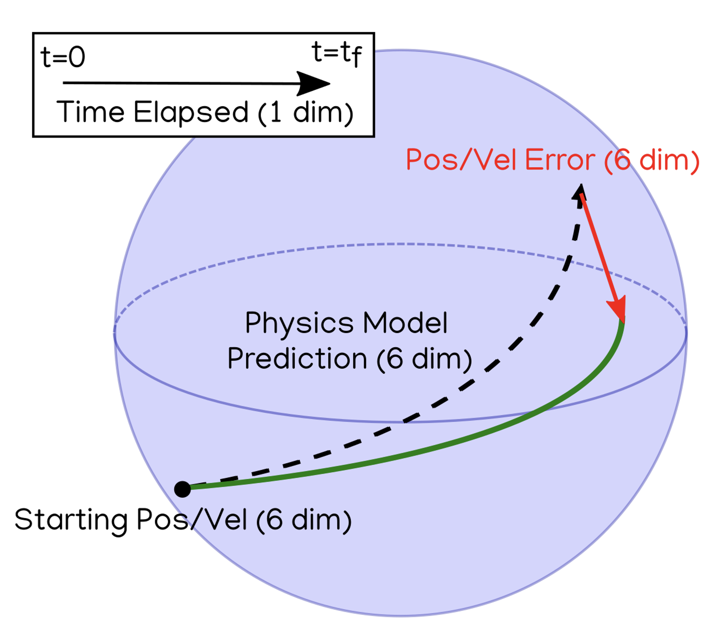
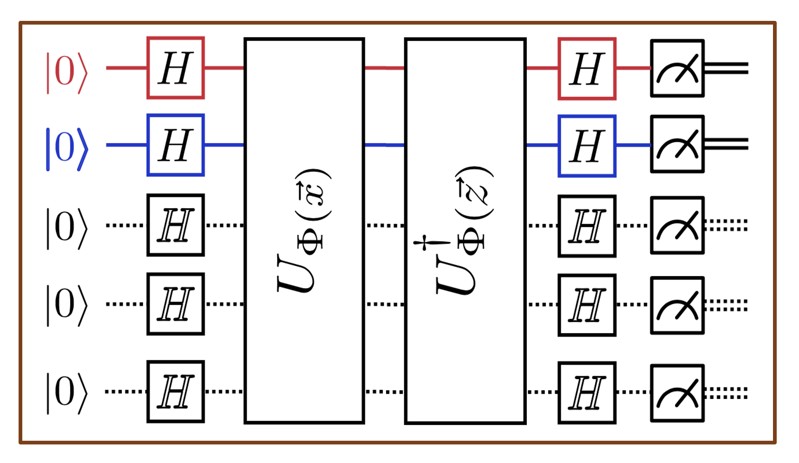
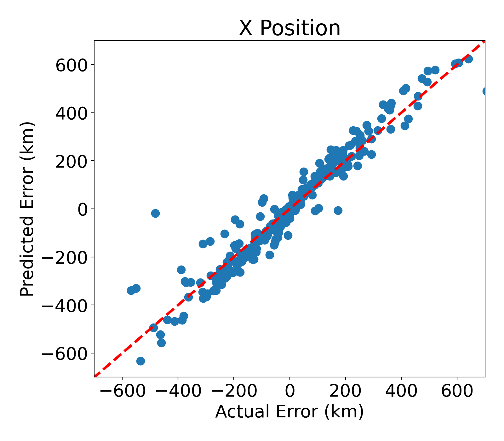
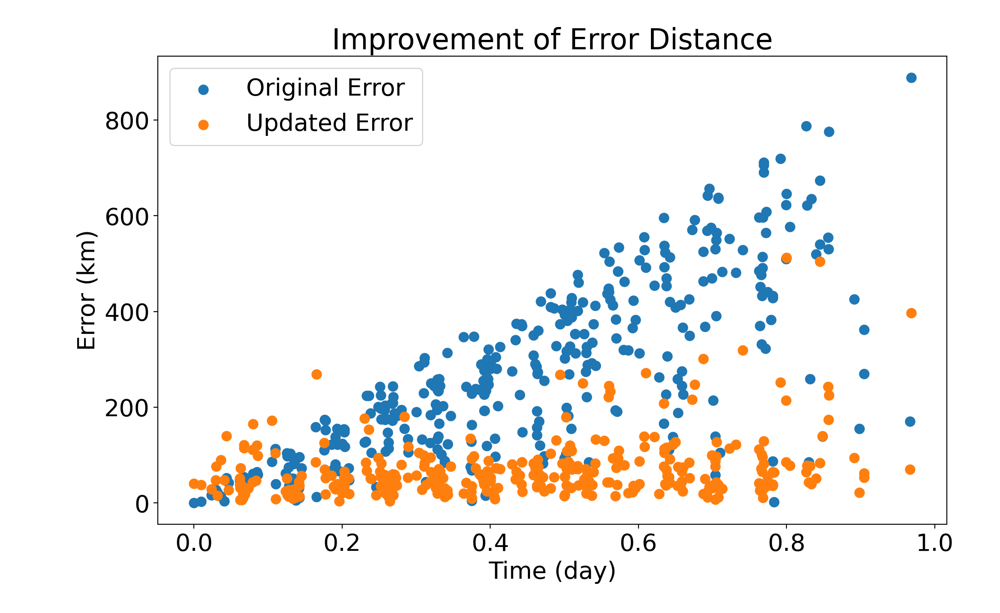

# Quantum Support Vector Regression on Space Orbit Predictions

This repository is a tutorial for implementing quantum support vector regression using Qiskit and applying it to low earth orbit trajectories to improve accuracy of future predictions.

# Installation

This package has been developed and tested on Python 3.8.10 We recommend using [conda](https://docs.conda.io/en/latest/) or [Python's virtual environments](https://docs.python.org/3/library/venv.html) for keeping dependencies separate from your system Python installation, such as 

```shell
conda create -n qsvr python=3.8
conda activate qsvr
```

```shell
python3 -m venv venv
source venv/bin/activate
```

Necessary packages for compiling the source codes can be installed using

```shell
% python -m pip install astropy joblib matplotlib numpy pandas poliastro==0.14.0 pyarrow scikit-learn spacetrack TLE-tools tqdm xgboost pylatexenc
```

and the kernel calculations as well as the final plot can be generated by running

```shell
% python src/main.py
```

# Introduction

## Low Earth Orbit Prediction

<center></center>

Our problem starts with 3 input variables: the starting position/velocity vector, future prediction of the position/velocity vector, and the time elapsed between the two. These variables constitute 13 dimensions -- 6 from starting, 6 from future, and 1 from time elapsed.

The future prediction is calculated using the [poliastro](https://docs.poliastro.space/en/stable/) astrodynamics library. The baseline physics model is a [two body model](https://en.wikipedia.org/wiki/Two-body_problem) that uses [Cowell's formulation](https://en.wikipedia.org/wiki/Perturbation_(astronomy)#Cowell.27s_formulation) for modeling the perturbation in a ASO's orbit caused by the Earth.

However this model can and does create some errors due to some bias that are not fully accounted for. In the figure above, this is shown as the red vector needed to fix the model prediction to the ground truth positions and velocities.

Our goal with this project is to recover this error from the 13 dimensional input the scientist knows a priori. Our method of choice will be support vector regression using a quantum kernel using Qiskit.

For the sake of simplicity, the data collection and cleanup has already been done for you in `src/main.py`

```python
spacetrack_client = etl.build_space_track_client( SPACETRACK_USERNAME,
                                                    SPACETRACK_PASSWORD )
spacetrack_etl = etl.SpaceTrackETL(spacetrack_client)
iss_orbit_data = spacetrack_etl.build_leo_df( norad_ids=['25544'],
                                              last_n_days=365,
                                              only_latest=None )
physics_model_predicted_orbits = training.predict_orbits( iss_orbit_data,
                                                            last_n_days=None,
                                                            n_pred_days=N_PRED_DAYS )
pickle.dump(physics_model_predicted_orbits, open("data/iss_data.pkl")
physics_model_errors = training.calc_physics_error(physics_model_predicted_orbits)
train_test_data      = ml.build_train_test_sets(physics_model_errors, test_size=0.25)
X_train, X_test, Y_train, Y_test = get_svm_input_output(train_test_data)
pickle.dump( X_train , open( "data/X_train.pkl", "wb" ) )
pickle.dump( X_test  , open( "data/X_test.pkl", "wb" )  )
pickle.dump( Y_train , open( "data/Y_train.pkl", "wb" ) )
pickle.dump( Y_test  , open( "data/Y_test.pkl", "wb" )  )
```

as a commented code block.

More information about how we pull orbit data from [United States Strategic Command](https://en.wikipedia.org/wiki/United_States_Strategic_Command) (USSTRATCOM) via the [space-track.org](https://www.space-track.org/) and how the training data is created can be found in [this repository](https://github.com/IBM/spacetech-ssa).

## Support Vector Regression

There are numerous resources online about the derivations of the Lagrangians used in support vector regression, such as [here](https://towardsdatascience.com/understanding-support-vector-machine-part-1-lagrange-multipliers-5c24a52ffc5e) and [here](https://towardsdatascience.com/understanding-support-vector-machine-part-2-kernel-trick-mercers-theorem-e1e6848c6c4d).

The main takeaway from those is the concept of the kernel trick, where the regression can be reduced to maximizing the following Lagrangian:

$$L_d(\alpha)=\sum_{i=1}^{t}\alpha_i-\frac{1}{2}\sum_{i,j=1}^{t}y_iy_j\alpha_i\alpha_jK(x_i,x_j)$$

under the constraint

$$\sum_{i=1}^t\alpha_iy_i=0$$

where $x_i,i=1..t$ are $t$ input vectors, $y_i$ are the corresponding observations to fit, and $K(x_i,x_j)$ is the kernel value between two input vectors. The kernel is simply any matrix that follows Mercer's theorem, requiring the kernel matrix to be both symmetric and positive semi-definite. Most commonly, the kernel represents a sort of distance metric such as the dot product, where higher values indicate a higher alignment between two vectors.

## Quantum Kernel and Qiskit

Instead of employing traditional kernels such as polynomial or gaussian kernels, we are going to try a quantum kernel by simulating quantum circuits and calculating the values via IBM's Qiskit. The circuit in question is shown below

<center></center>

where the two center $U_{\Phi}$ [gates](https://qiskit.org/documentation/stubs/qiskit.circuit.library.PauliFeatureMap.html) are unitary operators comprised of phase and Pauli gates encoding our input vectors. A cursory view shows that if the two input vectors $x$ and $z$ are identical, the entire circuit becomes the identity circuit and the zero qubits will simply pass through and will be measured as zero cubits. Using Qiskit, this is implemented in `src/kernels/quantum.py` as

```python
circ = QuantumCircuit(num_qubits)
u_x  = ZZFeatureMap(num_qubits, reps=NUM_REPS)
u_x  = u_x.bind_parameters(x_vec*PHASE_SCALING)
circ = circ.compose(u_x)
u_z  = ZZFeatureMap(num_qubits, reps=NUM_REPS).inverse()
u_z  = u_z.bind_parameters(z_vec*PHASE_SCALING)
circ = circ.compose(u_z)
```

Our quantum kernel that we will feed into the regression will be the probability that you will measure all zero qubits. This number which ranges from 0 to 1 is our quantum "dot product" where higher number indicates higher alignment.

```python
state = Statevector.from_int(0,2**num_qubits)
state = state.evolve(circ)
cnt = 0
v = np.square(np.abs(state.data))
val = v[0]
```

We calculate all elements of the training and testing kernel matrices in `src/main.py` using

```python
# Loading cleaned train and test data
X_train = pickle.load( open( "data/X_train.pkl", "rb" ) )
X_test  = pickle.load( open( "data/X_test.pkl", "rb" )  )
Y_train = pickle.load( open( "data/Y_train.pkl", "rb" ) )
Y_test  = pickle.load( open( "data/Y_test.pkl", "rb" )  )

# Calculating Gram matrix using quantum kernel
X_train_gram = q_kernel.calc_gram_sym(X_train)
np.save('./data/quantum/X_train_gram_1_rep_0_bit_scale_08.npy',X_train_gram)
X_test_gram  = q_kernel.calc_gram(X_test,X_train)
np.save('./data/quantum/X_test_gram_1_rep_0_bit_scale_08.npy',X_test_gram)
```

and `X_train_gram` should definitely be checked to see whether it's symmetric and positive semi-definite.

The regression itself is fairly simple by using `SVR` from `sklearn.svm` and calling with flag `kernel='precomputed'` and inputting our precomputed kernels.

# Results

## Quantum Kernel Results

When you successfully run `./src/main.py`, you will end up with a plot that looks like this:

<center></center>

This is the result of the regression on the test data set in the x direction of the position. The horizontal axis represents the actual error in the position, and the vertical axis represents our best estimate of the error. If our regression worked perfectly, you will find all points lying on the dotted $x=y$ line. Unfortunately, we don't have that here but we calcuate a high correlation coefficient of 97% and a reduction of x position error from roughly 200km to 50km!

If you do the process for all x, y, and z variables and plot the improvement of the error distance, you can plot something like this

<center></center>

where blue points are the error distance from the ground truth and the orange points are the error distance after incorporating the results from the QSVR regression.

## Variables to Consider 

Quantum kernels are non-linear and fairly complex so you can manipulate some variables to adjust the overfitting/underfitting to fine tune the regression.

| Field | Description | Used value |
|-------|-------------|------|
| Scaling input vector | Kernel is nonlinear. Larger magnitudes of input variables tend to overfit regressions. | L2-norm roughly 1 |
| Applying exponent | Applying an exponent to the kernel value after evaluation. Larger exponents overfit regressions. | exponent=2 |
| Repetitions in Pauli expansions | Pauli feature maps can be repeated many times in the quantum circuit. More repetitions means more complexity in feature space. | repetitions=1 |
| Measuring more qubits | Relaxing # of qubits that are allowed to measure as 1. Relaxing this constraint underfits regression. | Only allowing all-zeros |
